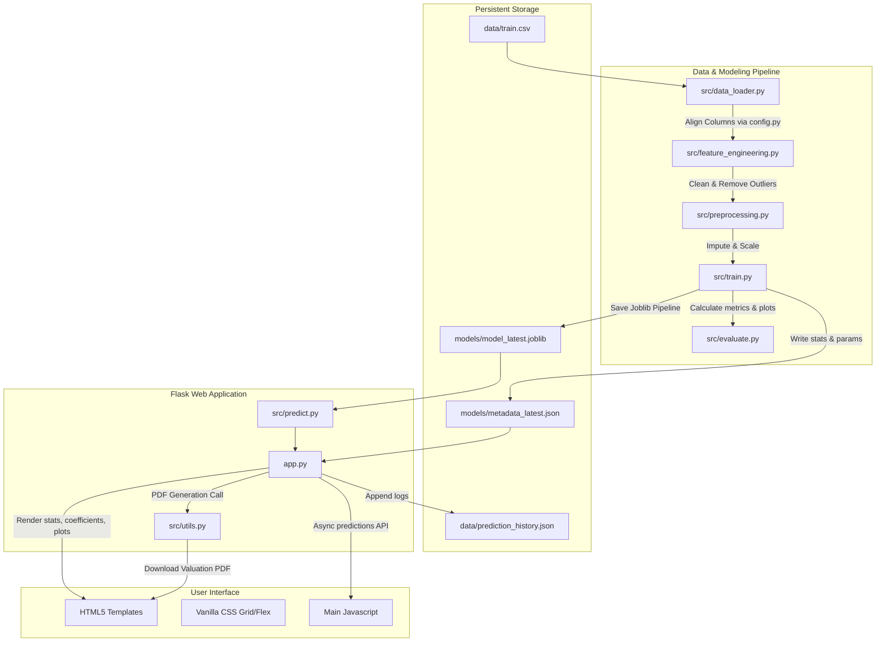

# Valuate: Premium House Price Prediction Engine

[](https://www.python.org/)
[](LICENSE)
[](https://flask.palletsprojects.com/)
[](https://scikit-learn.org/)

Valuate is a production-quality, modular Machine Learning application designed to predict house prices using key numerical specifications: Square Footage, Number of Bedrooms, and Number of Bathrooms. It features a complete end-to-end data cleaning, preprocessing, OLS estimation, and model registry pipeline, wrapped inside a premium, minimalist SaaS-inspired Flask web dashboard.

---

## Architecture Diagram

The system separates raw ingestion schemas from internal modeling components to support dataset changes with zero code modifications:



---

## Folder Structure

```
house-price-prediction/
│
├── app.py                      # Flask Application entrypoint
├── config.py                   # Configuration and column mappings
├── requirements.txt            # Python package dependencies
├── Procfile                    # Deployment command file for Render/Railway
├── runtime.txt                 # Python runtime version definition
├── LICENSE                     # MIT License
├── .gitignore                  # Git ignore rules
├── README.md                   # Premium documentation
│
├── data/                       # Raw CSVs & runtime logs
│   ├── train.csv
│   └── test.csv
│
├── models/                     # Registry of serialized pipeline runs
│   ├── model_latest.joblib     # Active fitted pipeline copy
│   └── metadata_latest.json    # Performance metrics & OLS coefficients
│
├── notebooks/                  # Professional Jupyter notebooks
│   ├── 01_EDA.ipynb            # Exploratory Data Analysis Report
│   ├── 02_Preprocessing.ipynb  # Transformation checks
│   └── 03_Model_Training.ipynb # Linear Regression parameter fitting
│
├── src/                        # Core ML Engine package
│   ├── __init__.py
│   ├── data_loader.py          # Column standardization mapping
│   ├── preprocessing.py        # Imputation & Standard Scaling pipelines
│   ├── feature_engineering.py  # Outlier removal via IQR method
│   ├── train.py                # Fitting and exporting registry models
│   ├── evaluate.py             # Plotting utilities and validation metrics
│   ├── predict.py              # Wrapper for single & batch predictions
│   ├── generate_mock_data.py   # Utility to create test CSV files
│   └── utils.py                # PDF valuation certificate generator
│
├── templates/                  # Flask Jinja2 HTML templates
│   ├── base.html               # Grid structure, navigation & theme switcher
│   ├── index.html              # Core Landing & single prediction form
│   ├── model_info.html         # Live metrics, feature weights, OLS equation & plots
│   ├── batch.html              # CSV drag-and-drop batch valuation uploads
│   ├── history.html            # Chronological prediction history auditing
│   └── 404.html                # Premium minimalist page-not-found layout
│
└── static/                     # Web assets
    ├── css/
    │   └── style.css           # Premium minimalist stylesheet
    ├── js/
    │   └── main.js             # Async requests, animations, dropzone file handlers
    └── images/                 # Exported validation diagnostic plots
```

---

## Installation & Setup

1. **Clone the repository** and navigate to the project directory:
   ```bash
   cd house-price-prediction
   ```

2. **Initialize a Virtual Environment**:
   ```bash
   python3 -m venv venv
   source venv/bin/activate
   ```

3. **Install Dependencies**:
   ```bash
   pip install -r requirements.txt
   ```

4. **Initialize Mock Dataset**:
   *The system is ready to self-initialize. Run this script to generate realistic training and test data immediately:*
   ```bash
   python3 src/generate_mock_data.py
   ```

---

## Running the Application Locally

1. **Train the ML model**:
   ```bash
   python3 src/train.py
   ```
   This fits the OLS Linear Regression, exports metrics, and generates diagnostic charts inside `static/images/`.

2. **Start the Flask Web App**:
   ```bash
   python3 app.py
   ```
   The application will start on `http://localhost:5000`. Open this URL in your web browser.

---

## Dataset Flexibility: How to Swap Datasets

To train this model on a completely new dataset (e.g. replacing `train.csv` with another house pricing sheet):

1. **Place the new files** in the `data/` directory (e.g., as `data/train.csv`).
2. **Open `config.py`** and locate `COLUMN_MAPPING`.
3. **Change the values** in `COLUMN_MAPPING` to match the exact column names of your new CSV file:
   ```python
   # Example: Mapping new dataset columns
   COLUMN_MAPPING = {
       "sqft": "SquareFootageCol",     # Name of sqft column in your new train.csv
       "bedrooms": "NumOfBedroomsCol", # Name of bedroom column in your new train.csv
       "bathrooms": "NumOfBathroomsCol",# Name of bathroom column in your new train.csv
       "target": "PriceCol"            # Name of target price column in your new train.csv
   }
   ```
4. **Define features types** in `config.py` (if your new dataset has additional columns, or if you want to run categorical features):
   ```python
   NUMERICAL_FEATURES = ["sqft", "bedrooms", "bathrooms"]
   CATEGORICAL_FEATURES = ["Neighborhood"] # Support strings out-of-the-box!
   ```
5. **Retrain the model**: Run `python3 src/train.py` or trigger the retraining directly from the web dashboard. The preprocessing transformer and linear estimator will dynamically adapt to the new columns!

---

## Deployment Guide

### Render / Railway
This project includes a `Procfile` and `runtime.txt` supporting standard cloud container builds out-of-the-box.
1. Create a Web Service pointing to your GitHub repository.
2. Build Command: `pip install -r requirements.txt && python src/generate_mock_data.py && python src/train.py`
3. Start Command: `gunicorn app:app`
4. Set Environment Variables:
   - `FLASK_SECRET_KEY`: A secure random string for signing prediction records.

### PythonAnywhere
1. Upload the files to PythonAnywhere.
2. Setup a Virtualenv and run `pip install -r requirements.txt`.
3. In the Web Tab, configure the WSGI configuration file:
   ```python
   import sys
   path = '/home/yourusername/house-price-prediction'
   if path not in sys.path:
       sys.path.append(path)
   from app import app as application
   ```

---

## Future Improvements
- **Model Upgrades**: Transition from basic OLS to Ridge/Lasso regularization or gradient boosting ensembles for higher accuracy.
- **Location Embedding**: Standardize coordinate inputs and reverse geocode them to capture location premiums.
- **Persistent Databases**: Swap the local history logs JSON file with a production SQLite or PostgreSQL connection.

---

## License

This project is licensed under the [MIT License](LICENSE).
